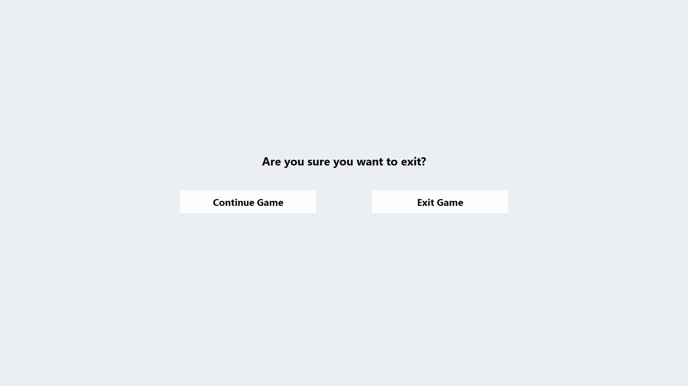

# Snake
I made Snake for my Programming Technology class during the fall of 2020.

My goal was to create an enjoyable game and create a GUI that didn't look like a traditional Swing GUI.

# Skills Demonstrated
* Built a Java-based game engine from scratch, which was used to create a fully functional 2D gaming experience.
* Created a full-screen Swing GUI using the library called FlatLaf.
* Built the game in a way that enables it to adapt to different screen sizes and resolutions.
* Implemented a ranking system for the top 100 attempts at beating the game using MySQL.
* Implemented a feature that replays the top 100 games in the main menu's background.

# Technologies Used
* Java
* Java Swing
* MySQL

# Impact
* The game exceeded the requirements, and I managed to hand in my project a month sooner than the rest of my class.
